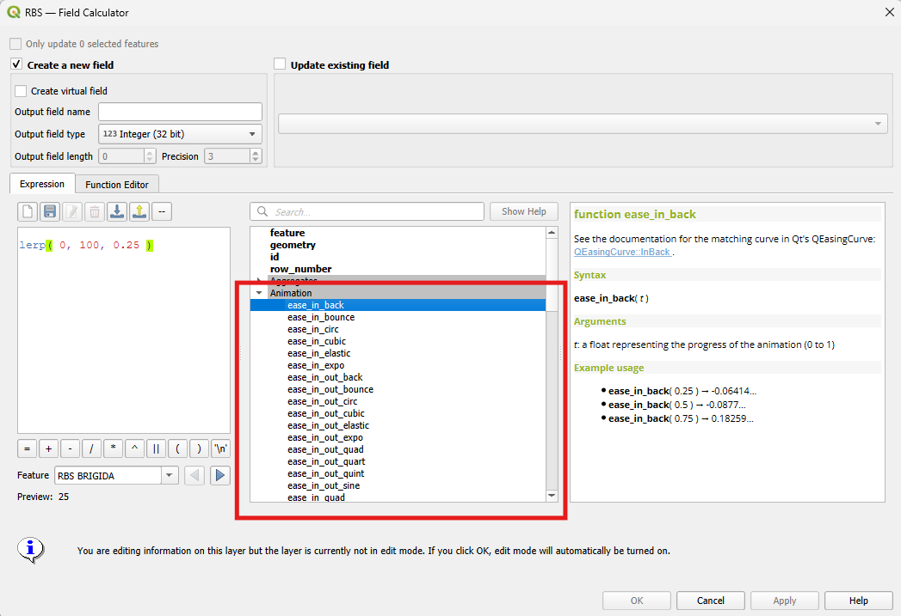

# YAAP (Yet Another Animation Plugin)

YAAP(Yet Another Animation Plugin) is a QGIS plugin that expand the capabilities of the temporal controller and the expression engine to create beautiful animation in QGIS.

Enhances your methodologies with animations, make data visualisation, educational video, or even art with it  

This plugin was created while creating these videos:
* https://lnkd.in/p/eJGA25DA
* https://youtu.be/VqZFsCQ5UJ4
* https://youtu.be/R6kVB-uChUg 

Introduction to animation in QGIS presented at Laax user conference: https://talks.osgeo.org/qgis-uc2026/talk/MNDQQH/


## How to use

The expressions functions of plugin are all located in the field calculator window under the "Animation" category





### Reference 

This section give an overview of the functions in the plugin. For a more complete explanation how they work please refer to the "in-line" documentation direclty inside QGIS. 
        
#### lerp

exemple usage : `lerp( 0, 100, 0.25 ) -> 25` 

#### lerp_unclamped

exemple usage : `lerp_unclamped( 0, 100, 0.25 ) -> 25` 
        
#### inverse_lerp

exemple usage : `inverse_lerp( 0, 100, 25 ) -> 0.25` 
        
#### inverse_lerp_unclamped

exemple usage : `lerp_unclamped( 0, 100, 1.2 ) -> 120 ` 
        
#### remap

exemple usage : `remap( 2, 0, 10, 0, 100 ) -> 20` 

#### ease_in_*

exemple usage : `ease_in_quad( 0.25 )` 

#### ease_in_out_*

exemple usage : `ease_in_out_quad( 0.25 )5` 

#### ease_out_* e.g: 

exemple usage : `ease_out_quad( 0.25 )` 

#### ease_out_in_*

exemple usage : `ease_out_in_quad( 0.25 )` 

## How to contribute 

### Obtain the source code 

Git clone this repository or git clone your fork

### Create a link from the QGIS profiles folder to the plugin folder `./YAAP_yet_another_animation_plugin`

e.g on Windows it looks like that, replace "Celia" with the appropriate directory on your machine
```
mklink /J C:\Users\Celia\AppData\Roaming\QGIS\QGIS3\profiles\default\python\plugins\YAAP_yet_another_animation_plugin C:\Users\Celia\Documents\YAAP-yet-another-animation-plugin\YAAP_yet_another_animation_plugin
```